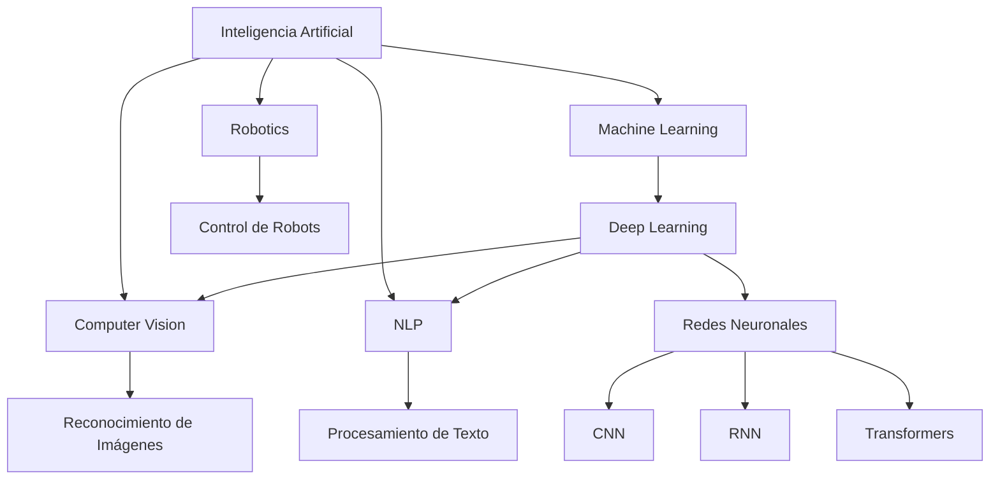

# Ramas de la Inteligencia Artificial

La IA es un campo multidisciplinario que abarca numerosas áreas especializadas. Cada rama se enfoca en aspectos específicos de la inteligencia y tiene sus propias técnicas, aplicaciones y desafíos.

## Machine Learning (Aprendizaje Automático)

### Descripción
Permite a las máquinas aprender y mejorar automáticamente a partir de la experiencia sin ser programadas explícitamente.

### Subcategorías
- **Aprendizaje Supervisado**: Entrenamiento con datos etiquetados
- **Aprendizaje No Supervisado**: Descubrimiento de patrones en datos sin etiquetar
- **Aprendizaje por Refuerzo**: Aprendizaje a través de interacción y retroalimentación

### Aplicaciones
- Reconocimiento de imágenes
- Sistemas de recomendación
- Detección de fraude
- Predicción de precios

## Deep Learning (Aprendizaje Profundo)

### Descripción
Subconjunto del ML que utiliza redes neuronales artificiales con múltiples capas para modelar y entender datos complejos.

### Arquitecturas Principales
- **Redes Neuronales Convolucionales (CNN)**: Visión por computadora
- **Redes Neuronales Recurrentes (RNN)**: Procesamiento de secuencias
- **Transformers**: Procesamiento de lenguaje natural
- **Redes Generativas Adversarias (GANs)**: Generación de contenido

### Aplicaciones
- Reconocimiento facial
- Traducción automática
- Generación de imágenes
- Vehículos autónomos

## Natural Language Processing (NLP)

### Descripción
Se enfoca en la interacción entre computadoras y lenguaje humano, permitiendo que las máquinas entiendan, interpreten y generen texto humano.

### Tareas Principales
- **Análisis de Sentimientos**: Determinar emociones en texto
- **Traducción Automática**: Conversión entre idiomas
- **Resumen Automático**: Crear resúmenes de textos largos
- **Generación de Texto**: Crear contenido original
- **Extracción de Información**: Identificar entidades y relaciones

### Aplicaciones
- Asistentes virtuales (Siri, Alexa)
- Chatbots
- Análisis de redes sociales
- Sistemas de búsqueda

## Computer Vision (Visión por Computadora)

### Descripción
Permite a las máquinas interpretar y entender información visual del mundo real.

### Tareas Principales
- **Clasificación de Imágenes**: Categorizar objetos en imágenes
- **Detección de Objetos**: Localizar y clasificar múltiples objetos
- **Segmentación**: Dividir imágenes en regiones semánticamente significativas
- **Reconocimiento Facial**: Identificar personas específicas
- **Análisis de Video**: Entender secuencias temporales

### Aplicaciones
- Diagnóstico médico por imágenes
- Vehículos autónomos
- Sistemas de seguridad
- Realidad aumentada

## Robotics (Robótica)

### Descripción
Integra IA con sistemas físicos para crear robots que pueden percibir, planificar y actuar en el mundo real.

### Áreas Clave
- **Navegación y Localización**: Movimiento en entornos complejos
- **Manipulación**: Interacción física con objetos
- **Percepción**: Interpretación de sensores
- **Planificación de Movimientos**: Optimización de trayectorias

### Aplicaciones
- Robots industriales
- Robots de servicio
- Drones autónomos
- Robots médicos

## Expert Systems (Sistemas Expertos)

### Descripción
Programas que emulan la capacidad de toma de decisiones de un experto humano en un dominio específico.

### Componentes
- **Base de Conocimiento**: Hechos y reglas del dominio
- **Motor de Inferencia**: Lógica para aplicar reglas
- **Interfaz de Usuario**: Comunicación con usuarios

### Aplicaciones
- Diagnóstico médico
- Configuración de sistemas
- Planificación financiera
- Análisis legal

## Fuzzy Logic (Lógica Difusa)

### Descripción
Maneja la incertidumbre y la imprecisión, permitiendo grados de verdad en lugar de valores booleanos estrictos.

### Características
- Valores entre 0 y 1
- Manejo de ambigüedad
- Razonamiento aproximado

### Aplicaciones
- Sistemas de control
- Electrodomésticos inteligentes
- Sistemas de aire acondicionado
- Control de tráfico

## Evolutionary Computation (Computación Evolutiva)

### Descripción
Utiliza mecanismos inspirados en la evolución biológica para resolver problemas de optimización.

### Algoritmos Principales
- **Algoritmos Genéticos**: Selección, cruce y mutación
- **Programación Evolutiva**: Evolución de parámetros
- **Estrategias Evolutivas**: Optimización numérica
- **Programación Genética**: Evolución de programas

### Aplicaciones
- Optimización de rutas
- Diseño de circuitos
- Planificación de horarios
- Ajuste de parámetros

## Knowledge Representation (Representación del Conocimiento)

### Descripción
Se enfoca en cómo representar información sobre el mundo de manera que un programa de computadora pueda utilizarla.

### Métodos
- **Ontologías**: Conceptos y relaciones formales
- **Grafos de Conocimiento**: Redes de entidades y relaciones
- **Lógica de Predicados**: Representación formal
- **Frames**: Estructuras de datos complejas

### Aplicaciones
- Motores de búsqueda semánticos
- Sistemas de gestión de conocimiento
- IA explicable
- Razonamiento automático

## Planning (Planificación)

### Descripción
Genera secuencias de acciones para alcanzar objetivos específicos en entornos complejos.

### Tipos
- **Planificación Clásica**: Entornos deterministas
- **Planificación bajo Incertidumbre**: Entornos estocásticos
- **Planificación Temporal**: Considerando tiempo
- **Planificación Multi-agente**: Múltiples actores

### Aplicaciones
- Logística y cadena de suministro
- Planificación de misiones espaciales
- Juegos estratégicos
- Automatización industrial

## Interconexiones entre Ramas

## Tendencias Futuras

### Áreas Emergentes
- **IA Explicable (XAI)**: Transparencia en decisiones de IA
- **IA Cuántica**: Combinación de computación cuántica e IA
- **IA Neuromorfa**: Hardware inspirado en el cerebro
- **IA Federada**: Aprendizaje distribuido preservando privacidad

### Convergencia de Disciplinas
- Combinación de NLP y Computer Vision (Visión-Lenguaje)
- Integración de IA con IoT
- IA en Edge Computing
- Sistemas multimodales
