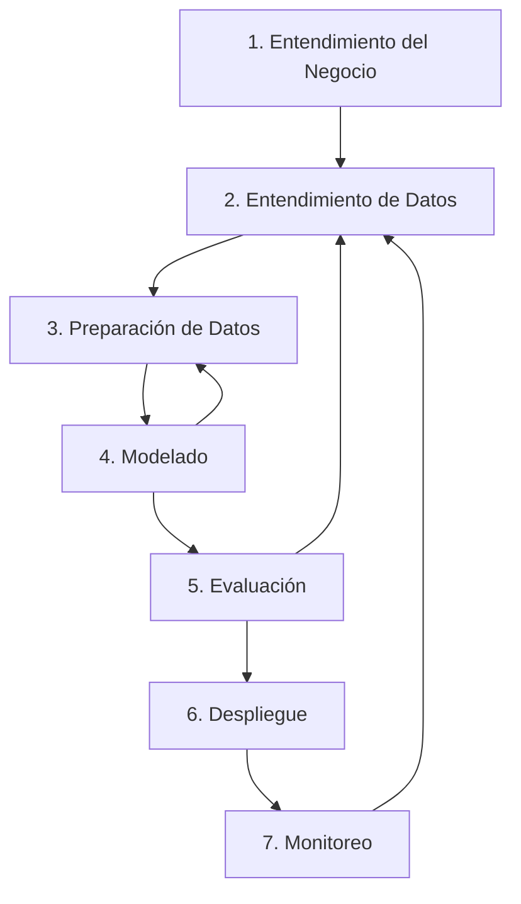

# Ciclo de Vida de un Proyecto de Machine Learning

El desarrollo de proyectos de Machine Learning requiere una metodología estructurada que va más allá del simple entrenamiento de modelos. Este ciclo de vida garantiza resultados exitosos y sostenibles.

## Visión General del Proceso



## Fase 1: Entendimiento del Negocio

### Objetivos
- Definir claramente el problema de negocio
- Establecer criterios de éxito
- Evaluar factibilidad del proyecto

### Actividades Clave

#### 1.1 Definición del Problema
- **Pregunta central**: ¿Qué problema específico estamos resolviendo?
- **Impacto esperado**: ¿Cómo mediremos el éxito?
- **Stakeholders**: ¿Quién se beneficiará de la solución?

#### 1.2 Análisis de Factibilidad
- **Disponibilidad de datos**: ¿Tenemos los datos necesarios?
- **Recursos**: ¿Contamos con tiempo, presupuesto y talento?
- **Restricciones**: ¿Existen limitaciones técnicas o regulatorias?

#### 1.3 Definición de Métricas
- **Métricas de negocio**: ROI, reducción de costos, incremento en ventas
- **Métricas técnicas**: Precisión, recall, F1-score
- **Línea base**: Rendimiento actual del sistema

### Entregables
- Document de definición del proyecto
- Criterios de éxito claramente definidos
- Plan de proyecto inicial

## Fase 2: Entendimiento de Datos

### Objetivos
- Familiarizarse con los datos disponibles
- Evaluar calidad y completitud
- Identificar problemas potenciales

### Actividades Clave

#### 2.1 Recolección de Datos
```python
# Ejemplo de recolección
import pandas as pd
import numpy as np

# Cargar datos de múltiples fuentes
datos_ventas = pd.read_csv('ventas.csv')
datos_clientes = pd.read_sql('SELECT * FROM clientes', conexion_db)
datos_externos = obtener_datos_api('weather_api')
```

#### 2.2 Análisis Exploratorio de Datos (EDA)
- **Estructura**: Dimensiones, tipos de datos, esquema
- **Distribuciones**: Histogramas, box plots, estadísticas descriptivas
- **Correlaciones**: Relaciones entre variables
- **Valores faltantes**: Patrones de datos ausentes
- **Outliers**: Identificación de valores atípicos

#### 2.3 Evaluación de Calidad
- **Completitud**: Porcentaje de datos faltantes
- **Exactitud**: Corrección de los datos
- **Consistencia**: Coherencia en formatos y valores
- **Actualidad**: Relevancia temporal de los datos

### Herramientas
- **Pandas Profiling**: Reporte automático de EDA
- **Matplotlib/Seaborn**: Visualizaciones
- **Plotly**: Gráficos interactivos

### Entregables
- Reporte de calidad de datos
- Visualizaciones exploratorias
- Catálogo de datos disponibles

## Fase 3: Preparación de Datos

### Objetivos
- Transformar datos crudos en formato utilizable
- Crear características relevantes
- Asegurar calidad para el modelado

### Actividades Clave

#### 3.1 Limpieza de Datos
```python
# Manejo de valores faltantes
datos_limpios = datos.dropna(subset=['columna_critica'])
datos_limpios['columna_numerica'].fillna(datos['columna_numerica'].median(), inplace=True)

# Detección y tratamiento de outliers
Q1 = datos['precio'].quantile(0.25)
Q3 = datos['precio'].quantile(0.75)
IQR = Q3 - Q1
datos_sin_outliers = datos[~((datos['precio'] < (Q1 - 1.5 * IQR)) | 
                            (datos['precio'] > (Q3 + 1.5 * IQR)))]
```

#### 3.2 Transformación de Datos
- **Normalización/Estandarización**: Escalado de variables numéricas
- **Encoding**: Conversión de variables categóricas
- **Binning**: Agrupación de valores continuos
- **Log transformation**: Para datos con distribución sesgada

#### 3.3 Ingeniería de Características
- **Creación de nuevas variables**: Combinaciones significativas
- **Selección de características**: Eliminación de variables irrelevantes
- **Extracción de características**: PCA, embeddings

```python
# Ejemplo de ingeniería de características
datos['precio_por_metro'] = datos['precio'] / datos['area']
datos['antiguedad'] = 2024 - datos['año_construccion']

# One-hot encoding para variables categóricas
datos_encoded = pd.get_dummies(datos, columns=['tipo_propiedad'])
```

#### 3.4 División de Datos
```python
from sklearn.model_selection import train_test_split

# División estratificada
X_train, X_temp, y_train, y_temp = train_test_split(
    X, y, test_size=0.4, stratify=y, random_state=42
)

X_val, X_test, y_val, y_test = train_test_split(
    X_temp, y_temp, test_size=0.5, stratify=y_temp, random_state=42
)
```

### Entregables
- Dataset limpio y procesado
- Scripts de transformación reutilizables
- Documentación de cambios realizados

## Fase 4: Modelado

### Objetivos
- Seleccionar algoritmos apropiados
- Entrenar y optimizar modelos
- Comparar diferentes enfoques

### Actividades Clave

#### 4.1 Selección de Algoritmos
- **Baseline simple**: Modelo básico como referencia
- **Múltiples algoritmos**: Probar diferentes enfoques
- **Consideraciones**: Interpretabilidad vs. rendimiento

#### 4.2 Entrenamiento Inicial
```python
from sklearn.ensemble import RandomForestClassifier
from sklearn.linear_model import LogisticRegression
from sklearn.svm import SVC

# Modelos candidatos
modelos = {
    'Random Forest': RandomForestClassifier(random_state=42),
    'Logistic Regression': LogisticRegression(random_state=42),
    'SVM': SVC(random_state=42)
}

# Entrenamiento y evaluación inicial
resultados = {}
for nombre, modelo in modelos.items():
    modelo.fit(X_train, y_train)
    score = modelo.score(X_val, y_val)
    resultados[nombre] = score
```

#### 4.3 Optimización de Hiperparámetros
```python
from sklearn.model_selection import GridSearchCV

# Grid search para Random Forest
param_grid = {
    'n_estimators': [100, 200, 300],
    'max_depth': [10, 20, None],
    'min_samples_split': [2, 5, 10]
}

grid_search = GridSearchCV(
    RandomForestClassifier(random_state=42),
    param_grid,
    cv=5,
    scoring='f1_macro'
)

grid_search.fit(X_train, y_train)
mejor_modelo = grid_search.best_estimator_
```

#### 4.4 Validación Cruzada
- **K-fold**: Evaluación robusta
- **Stratified**: Para datos desbalanceados
- **Time series split**: Para datos temporales

### Entregables
- Modelos entrenados
- Resultados de validación cruzada
- Configuración óptima de hiperparámetros

## Fase 5: Evaluación

### Objetivos
- Evaluar rendimiento del modelo
- Verificar cumplimiento de objetivos de negocio
- Analizar limitaciones y sesgos

### Actividades Clave

#### 5.1 Evaluación Técnica
```python
from sklearn.metrics import classification_report, confusion_matrix

# Predicciones en conjunto de prueba
y_pred = mejor_modelo.predict(X_test)

# Métricas detalladas
print(classification_report(y_test, y_pred))
print(confusion_matrix(y_test, y_pred))
```

#### 5.2 Evaluación de Negocio
- **ROI estimado**: Retorno de inversión esperado
- **Impacto operacional**: Cambios en procesos
- **Satisfacción del usuario**: Feedback de stakeholders

#### 5.3 Análisis de Sesgo
- **Fairness**: Equidad entre grupos demográficos
- **Interpretabilidad**: Explicación de decisiones
- **Robustez**: Rendimiento en diferentes escenarios

#### 5.4 Pruebas A/B
```python
# Diseño de experimento
grupo_control = usuarios_muestra[:50%]  # Modelo actual
grupo_tratamiento = usuarios_muestra[50%:]  # Nuevo modelo

# Métricas de negocio
conversion_control = calcular_conversion(grupo_control)
conversion_tratamiento = calcular_conversion(grupo_tratamiento)
```

### Entregables
- Reporte de evaluación completo
- Análisis de costo-beneficio
- Recomendaciones para mejora

## Fase 6: Despliegue

### Objetivos
- Poner el modelo en producción
- Integrar con sistemas existentes
- Asegurar escalabilidad y disponibilidad

### Actividades Clave

#### 6.1 Preparación para Producción
```python
import joblib
import pickle

# Serialización del modelo
joblib.dump(mejor_modelo, 'modelo_produccion.pkl')

# Pipeline completo
pipeline_completo = Pipeline([
    ('preprocessor', preprocessor),
    ('modelo', mejor_modelo)
])
```

#### 6.2 Estrategias de Despliegue
- **Batch prediction**: Predicciones por lotes
- **Real-time serving**: API en tiempo real
- **Edge deployment**: Modelo en dispositivos locales

#### 6.3 Infraestructura
- **Containerización**: Docker, Kubernetes
- **API Gateway**: Gestión de endpoints
- **Load balancing**: Distribución de carga
- **Monitoring**: Logs, métricas, alertas

```python
# Ejemplo de API con Flask
from flask import Flask, request, jsonify

app = Flask(__name__)
modelo = joblib.load('modelo_produccion.pkl')

@app.route('/predict', methods=['POST'])
def predict():
    datos = request.json
    prediccion = modelo.predict([datos['features']])
    return jsonify({'prediction': prediccion[0]})
```

### Entregables
- Modelo deployado en producción
- Documentación de API
- Procedimientos de rollback

## Fase 7: Monitoreo y Mantenimiento

### Objetivos
- Supervisar rendimiento en producción
- Detectar degradación del modelo
- Planificar actualizaciones

### Actividades Clave

#### 7.1 Monitoreo de Rendimiento
```python
# Métricas de sistema
latencia_promedio = monitor.get_latency()
throughput = monitor.get_requests_per_second()
error_rate = monitor.get_error_rate()

# Métricas de modelo
drift_score = detect_data_drift(new_data, training_data)
accuracy_current = evaluate_model(model, current_data)
```

#### 7.2 Detección de Deriva
- **Data drift**: Cambios en distribución de entrada
- **Concept drift**: Cambios en relación entrada-salida
- **Population drift**: Cambios en población objetivo

#### 7.3 Reentrenamiento
```python
# Criterios para reentrenamiento
if accuracy_current < threshold_accuracy:
    retrain_model()

if drift_score > threshold_drift:
    update_model_with_new_data()
```

### Herramientas de Monitoreo
- **Evidently AI**: Detección de deriva
- **Weights & Biases**: Tracking de experimentos
- **MLflow**: Gestión de ciclo de vida ML
- **Prometheus + Grafana**: Métricas y visualización

### Entregables
- Dashboard de monitoreo
- Alertas automatizadas
- Plan de mantenimiento

## Mejores Prácticas

### Documentación
- Versionado de modelos
- Registro de experimentos
- Documentación de decisiones

### Colaboración
- Revisión de código
- Revisión de modelos por pares
- Comunicación clara con stakeholders

### Reproducibilidad
- Control de versiones de datos
- Environments reproducibles
- Seeds aleatorias fijas

### Gobernanza
- Políticas de privacidad
- Auditorías regulares
- Cumplimiento regulatorio

El ciclo de vida de ML es iterativo y continuo, requiriendo adaptación constante a medida que cambian los datos, el negocio y la tecnología.
