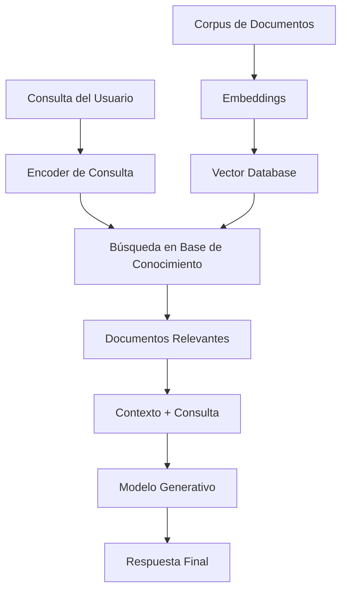

# RAG - Retrieval Augmented Generation

## ¿Qué es RAG?

**RAG (Retrieval Augmented Generation)** es una arquitectura que combina un sistema de recuperación de información con un modelo de generación de lenguaje. Esta técnica permite a los modelos de IA acceder a conocimiento externo actualizado y específico, mejorando significativamente la calidad y precisión de las respuestas generadas.

## Arquitectura de RAG



## Componentes Principales

### 1. Sistema de Recuperación (Retriever)

El retriever busca información relevante en una base de conocimiento externa.

```python
from sentence_transformers import SentenceTransformer
import faiss
import numpy as np
import pickle

class DenseRetriever:
    def __init__(self, model_name='all-MiniLM-L6-v2'):
        self.encoder = SentenceTransformer(model_name)
        self.index = None
        self.documents = []
        self.embeddings = None
    
    def index_documents(self, documents):
        """Indexa documentos para búsqueda rápida"""
        self.documents = documents
        
        # Generar embeddings
        print("Generando embeddings para documentos...")
        self.embeddings = self.encoder.encode(documents, show_progress_bar=True)
        
        # Crear índice FAISS
        dimension = self.embeddings.shape[1]
        self.index = faiss.IndexFlatIP(dimension)  # Producto interno
        
        # Normalizar para similitud coseno
        faiss.normalize_L2(self.embeddings)
        self.index.add(self.embeddings.astype('float32'))
        
        print(f"Indexados {len(documents)} documentos")
    
    def search(self, query, k=5):
        """Busca documentos relevantes para una consulta"""
        if self.index is None:
            raise ValueError("Debe indexar documentos primero")
        
        # Codificar consulta
        query_embedding = self.encoder.encode([query])
        faiss.normalize_L2(query_embedding)
        
        # Buscar
        scores, indices = self.index.search(query_embedding.astype('float32'), k)
        
        results = []
        for score, idx in zip(scores[0], indices[0]):
            if idx != -1:  # FAISS devuelve -1 para no encontrado
                results.append({
                    'document': self.documents[idx],
                    'score': float(score),
                    'index': int(idx)
                })
        
        return results
    
    def save_index(self, path):
        """Guarda el índice y documentos"""
        faiss.write_index(self.index, f"{path}.faiss")
        with open(f"{path}.pkl", 'wb') as f:
            pickle.dump({
                'documents': self.documents,
                'embeddings': self.embeddings
            }, f)
    
    def load_index(self, path):
        """Carga el índice y documentos"""
        self.index = faiss.read_index(f"{path}.faiss")
        with open(f"{path}.pkl", 'rb') as f:
            data = pickle.load(f)
            self.documents = data['documents']
            self.embeddings = data['embeddings']

# Ejemplo de uso
retriever = DenseRetriever()

# Documentos de ejemplo sobre IA
documentos = [
    "El machine learning es una rama de la inteligencia artificial que permite a las máquinas aprender patrones de los datos sin ser programadas explícitamente.",
    "Las redes neuronales artificiales están inspiradas en el funcionamiento del cerebro humano y consisten en capas de neuronas conectadas.",
    "El deep learning utiliza redes neuronales profundas con múltiples capas ocultas para resolver problemas complejos de reconocimiento de patrones.",
    "Los transformers son una arquitectura de red neuronal que utiliza mecanismos de atención para procesar secuencias de datos de manera más eficiente.",
    "BERT es un modelo de lenguaje preentrenado basado en transformers que puede ser fine-tuneado para múltiples tareas de NLP.",
    "GPT (Generative Pre-trained Transformer) es una familia de modelos de lenguaje que pueden generar texto coherente y contextualmente relevante.",
    "El procesamiento de lenguaje natural (NLP) es un campo que combina lingüística, ciencia de la computación e inteligencia artificial.",
    "Los embeddings son representaciones vectoriales de palabras o frases que capturan relaciones semánticas en espacios multidimensionales."
]

retriever.index_documents(documentos)

# Buscar documentos relevantes
query = "¿Qué son las redes neuronales?"
results = retriever.search(query, k=3)

print(f"Consulta: {query}\n")
for i, result in enumerate(results, 1):
    print(f"{i}. Score: {result['score']:.3f}")
    print(f"   Documento: {result['document']}\n")
```

### 2. Generador (Generator)

El generador combina la consulta original con los documentos recuperados para generar una respuesta.

```python
from transformers import AutoTokenizer, AutoModelForCausalLM, pipeline
import torch

class RAGGenerator:
    def __init__(self, model_name='microsoft/DialoGPT-medium'):
        self.device = torch.device('cuda' if torch.cuda.is_available() else 'cpu')
        self.tokenizer = AutoTokenizer.from_pretrained(model_name)
        self.model = AutoModelForCausalLM.from_pretrained(model_name)
        self.model.to(self.device)
        
        # Configurar token de padding si no existe
        if self.tokenizer.pad_token is None:
            self.tokenizer.pad_token = self.tokenizer.eos_token
    
    def generate_answer(self, query, retrieved_docs, max_length=500):
        """Genera respuesta basada en consulta y documentos recuperados"""
        
        # Construir contexto
        context = "\n".join([f"Contexto {i+1}: {doc['document']}" 
                           for i, doc in enumerate(retrieved_docs)])
        
        # Crear prompt
        prompt = f"""Basándote en el siguiente contexto, responde la pregunta de manera precisa y completa.

Contexto:
{context}

Pregunta: {query}

Respuesta:"""
        
        # Tokenizar
        inputs = self.tokenizer.encode(prompt, return_tensors='pt', 
                                     truncation=True, max_length=1024)
        inputs = inputs.to(self.device)
        
        # Generar respuesta
        with torch.no_grad():
            outputs = self.model.generate(
                inputs,
                max_length=max_length,
                num_return_sequences=1,
                temperature=0.7,
                do_sample=True,
                pad_token_id=self.tokenizer.eos_token_id
            )
        
        # Decodificar y limpiar
        generated = self.tokenizer.decode(outputs[0], skip_special_tokens=True)
        
        # Extraer solo la respuesta (después de "Respuesta:")
        if "Respuesta:" in generated:
            answer = generated.split("Respuesta:")[-1].strip()
        else:
            answer = generated[len(prompt):].strip()
        
        return answer

# Usar un modelo más específico para Q&A
class RAGGeneratorWithT5:
    def __init__(self):
        self.qa_pipeline = pipeline(
            "text2text-generation",
            model="google/flan-t5-base",
            device=0 if torch.cuda.is_available() else -1
        )
    
    def generate_answer(self, query, retrieved_docs, max_length=200):
        """Genera respuesta usando T5"""
        
        # Combinar documentos
        context = " ".join([doc['document'] for doc in retrieved_docs])
        
        # Crear prompt para T5
        prompt = f"""Pregunta: {query}
Contexto: {context}
Respuesta:"""
        
        # Generar
        result = self.qa_pipeline(
            prompt,
            max_length=max_length,
            do_sample=True,
            temperature=0.3
        )
        
        return result[0]['generated_text']

# Ejemplo de uso
generator = RAGGeneratorWithT5()

# Usar resultados del retriever anterior
query = "¿Qué son las redes neuronales?"
retrieved_docs = retriever.search(query, k=2)

answer = generator.generate_answer(query, retrieved_docs)
print(f"Pregunta: {query}")
print(f"Respuesta: {answer}")
```

### 3. Sistema RAG Completo

```python
class RAGSystem:
    def __init__(self, retriever_model='all-MiniLM-L6-v2'):
        self.retriever = DenseRetriever(retriever_model)
        self.generator = RAGGeneratorWithT5()
        self.is_indexed = False
    
    def index_knowledge_base(self, documents):
        """Indexa la base de conocimiento"""
        print("Indexando base de conocimiento...")
        self.retriever.index_documents(documents)
        self.is_indexed = True
        print("¡Base de conocimiento indexada!")
    
    def query(self, question, k=3, min_score=0.3):
        """Procesa una consulta completa"""
        if not self.is_indexed:
            raise ValueError("Debe indexar la base de conocimiento primero")
        
        # Paso 1: Recuperar documentos relevantes
        print(f"🔍 Buscando información para: '{question}'")
        retrieved_docs = self.retriever.search(question, k=k)
        
        # Filtrar por score mínimo
        retrieved_docs = [doc for doc in retrieved_docs if doc['score'] >= min_score]
        
        if not retrieved_docs:
            return {
                'answer': "No encontré información relevante para responder esta pregunta.",
                'sources': [],
                'confidence': 0.0
            }
        
        print(f"📚 Encontrados {len(retrieved_docs)} documentos relevantes")
        
        # Paso 2: Generar respuesta
        print("🤖 Generando respuesta...")
        answer = self.generator.generate_answer(question, retrieved_docs)
        
        # Calcular confianza promedio
        confidence = np.mean([doc['score'] for doc in retrieved_docs])
        
        return {
            'answer': answer,
            'sources': retrieved_docs,
            'confidence': float(confidence)
        }
    
    def chat(self):
        """Interfaz de chat interactiva"""
        print("💬 Sistema RAG iniciado. Escribe 'salir' para terminar.\n")
        
        while True:
            question = input("❓ Tu pregunta: ").strip()
            
            if question.lower() in ['salir', 'exit', 'quit']:
                print("👋 ¡Hasta luego!")
                break
            
            if not question:
                continue
            
            try:
                result = self.query(question)
                
                print(f"\n🤖 Respuesta: {result['answer']}")
                print(f"🎯 Confianza: {result['confidence']:.2f}")
                
                if result['sources']:
                    print(f"\n📖 Fuentes utilizadas:")
                    for i, source in enumerate(result['sources'], 1):
                        print(f"   {i}. {source['document'][:100]}...")
                
                print("-" * 80 + "\n")
                
            except Exception as e:
                print(f"❌ Error: {e}\n")

# Crear y usar el sistema RAG
rag_system = RAGSystem()

# Base de conocimiento expandida
knowledge_base = [
    "El machine learning es una rama de la inteligencia artificial que permite a las máquinas aprender patrones de los datos sin ser programadas explícitamente para cada tarea específica.",
    "Las redes neuronales artificiales están inspiradas en el funcionamiento del cerebro humano y consisten en capas de neuronas artificiales conectadas que procesan información.",
    "El deep learning utiliza redes neuronales profundas con múltiples capas ocultas para resolver problemas complejos como reconocimiento de imágenes y procesamiento de lenguaje natural.",
    "Los transformers son una arquitectura revolucionaria que utiliza mecanismos de atención para procesar secuencias de datos de manera más eficiente que las RNN tradicionales.",
    "BERT (Bidirectional Encoder Representations from Transformers) es un modelo preentrenado que puede ser fine-tuneado para múltiples tareas de NLP.",
    "GPT (Generative Pre-trained Transformer) es una familia de modelos autoregresivos que pueden generar texto coherente y contextualmente relevante.",
    "El procesamiento de lenguaje natural combina lingüística, ciencia de la computación e inteligencia artificial para que las máquinas entiendan el lenguaje humano.",
    "Los embeddings son representaciones vectoriales que capturan relaciones semánticas entre palabras, frases o documentos en espacios multidimensionales.",
    "El overfitting ocurre cuando un modelo aprende demasiado específicamente los datos de entrenamiento y no generaliza bien a datos nuevos.",
    "La validación cruzada es una técnica para evaluar modelos dividiendo los datos en múltiples folds para obtener una estimación más robusta del rendimiento.",
    "Las funciones de activación como ReLU, sigmoid y tanh determinan cómo las neuronas procesan y transmiten información en una red neuronal.",
    "El gradient descent es un algoritmo de optimización que ajusta los pesos de la red neuronal para minimizar la función de pérdida.",
    "La regularización incluye técnicas como dropout y L2 regularization para prevenir el overfitting en modelos de machine learning.",
    "Los algoritmos de clustering como K-means y DBSCAN agrupan datos similares sin supervisión para descubrir patrones ocultos.",
    "La inteligencia artificial general (AGI) se refiere a sistemas de IA que pueden realizar cualquier tarea intelectual que un humano puede hacer."
]

# Indexar base de conocimiento
rag_system.index_knowledge_base(knowledge_base)

# Ejemplo de consultas
ejemplos_consultas = [
    "¿Qué es el deep learning?",
    "¿Cómo funcionan los transformers?",
    "¿Qué es el overfitting?",
    "Explícame qué son los embeddings"
]

print("🧪 Ejemplos de consultas:\n")
for consulta in ejemplos_consultas:
    result = rag_system.query(consulta)
    print(f"❓ {consulta}")
    print(f"🤖 {result['answer']}")
    print(f"🎯 Confianza: {result['confidence']:.2f}\n")
    print("-" * 80 + "\n")
```

## Mejoras Avanzadas

### 1. RAG con Re-ranking

```python
from transformers import AutoTokenizer, AutoModelForSequenceClassification
import torch

class CrossEncoderReranker:
    def __init__(self, model_name='cross-encoder/ms-marco-MiniLM-L-6-v2'):
        self.tokenizer = AutoTokenizer.from_pretrained(model_name)
        self.model = AutoModelForSequenceClassification.from_pretrained(model_name)
        self.device = torch.device('cuda' if torch.cuda.is_available() else 'cpu')
        self.model.to(self.device)
    
    def rerank(self, query, documents, top_k=3):
        """Re-rankea documentos basado en relevancia específica a la consulta"""
        scores = []
        
        for doc in documents:
            # Crear par consulta-documento
            inputs = self.tokenizer(
                query, doc['document'],
                truncation=True,
                padding=True,
                return_tensors='pt'
            ).to(self.device)
            
            # Calcular score de relevancia
            with torch.no_grad():
                outputs = self.model(**inputs)
                score = torch.sigmoid(outputs.logits).item()
            
            scores.append(score)
        
        # Combinar con scores originales y re-rankear
        for i, doc in enumerate(documents):
            doc['rerank_score'] = scores[i]
            doc['combined_score'] = (doc['score'] + scores[i]) / 2
        
        # Ordenar por score combinado
        reranked = sorted(documents, key=lambda x: x['combined_score'], reverse=True)
        
        return reranked[:top_k]

class EnhancedRAGSystem(RAGSystem):
    def __init__(self, retriever_model='all-MiniLM-L6-v2'):
        super().__init__(retriever_model)
        self.reranker = CrossEncoderReranker()
    
    def query(self, question, k=5, final_k=3, min_score=0.2):
        """Consulta con re-ranking"""
        if not self.is_indexed:
            raise ValueError("Debe indexar la base de conocimiento primero")
        
        # Paso 1: Recuperación inicial (más documentos)
        retrieved_docs = self.retriever.search(question, k=k)
        retrieved_docs = [doc for doc in retrieved_docs if doc['score'] >= min_score]
        
        if not retrieved_docs:
            return {
                'answer': "No encontré información relevante.",
                'sources': [],
                'confidence': 0.0
            }
        
        # Paso 2: Re-ranking
        reranked_docs = self.reranker.rerank(question, retrieved_docs, top_k=final_k)
        
        # Paso 3: Generación
        answer = self.generator.generate_answer(question, reranked_docs)
        
        confidence = np.mean([doc['combined_score'] for doc in reranked_docs])
        
        return {
            'answer': answer,
            'sources': reranked_docs,
            'confidence': float(confidence)
        }
```

### 2. RAG con Memoria Conversacional

```python
class ConversationalRAG(EnhancedRAGSystem):
    def __init__(self, retriever_model='all-MiniLM-L6-v2'):
        super().__init__(retriever_model)
        self.conversation_history = []
        self.max_history = 5
    
    def add_to_history(self, question, answer):
        """Añade intercambio a la historia conversacional"""
        self.conversation_history.append({
            'question': question,
            'answer': answer
        })
        
        # Mantener solo los últimos N intercambios
        if len(self.conversation_history) > self.max_history:
            self.conversation_history.pop(0)
    
    def build_context_with_history(self, current_question):
        """Construye contexto incluyendo historia conversacional"""
        context_parts = []
        
        # Añadir historia previa
        for exchange in self.conversation_history[-3:]:  # Solo últimos 3
            context_parts.append(f"P: {exchange['question']}")
            context_parts.append(f"R: {exchange['answer']}")
        
        # Añadir pregunta actual
        context_parts.append(f"P: {current_question}")
        
        return "\n".join(context_parts)
    
    def query(self, question, k=5, final_k=3, min_score=0.2):
        """Consulta con contexto conversacional"""
        
        # Construir consulta enriquecida con contexto
        enriched_query = self.build_context_with_history(question)
        
        # Usar la consulta enriquecida para búsqueda
        result = super().query(enriched_query, k, final_k, min_score)
        
        # Añadir a historia si se obtuvo respuesta válida
        if result['confidence'] > 0.3:
            self.add_to_history(question, result['answer'])
        
        return result
    
    def reset_conversation(self):
        """Reinicia la conversación"""
        self.conversation_history = []
        print("🔄 Historia conversacional reiniciada")
```

## Evaluación de Sistemas RAG

### 1. Métricas de Recuperación

```python
def evaluar_recuperacion(retriever, queries_con_documentos_relevantes):
    """
    Evalúa la calidad del componente de recuperación
    """
    total_precision = 0
    total_recall = 0
    total_mrr = 0  # Mean Reciprocal Rank
    
    for query, docs_relevantes in queries_con_documentos_relevantes:
        # Recuperar documentos
        retrieved = retriever.search(query, k=10)
        retrieved_docs = [doc['document'] for doc in retrieved]
        
        # Calcular métricas
        relevant_retrieved = set(retrieved_docs) & set(docs_relevantes)
        
        # Precision@k
        precision = len(relevant_retrieved) / len(retrieved_docs) if retrieved_docs else 0
        
        # Recall
        recall = len(relevant_retrieved) / len(docs_relevantes) if docs_relevantes else 0
        
        # MRR (Mean Reciprocal Rank)
        mrr = 0
        for i, doc in enumerate(retrieved_docs):
            if doc in docs_relevantes:
                mrr = 1 / (i + 1)
                break
        
        total_precision += precision
        total_recall += recall
        total_mrr += mrr
    
    n_queries = len(queries_con_documentos_relevantes)
    return {
        'precision': total_precision / n_queries,
        'recall': total_recall / n_queries,
        'mrr': total_mrr / n_queries
    }
```

### 2. Métricas de Generación

```python
from rouge import Rouge
from sentence_transformers import SentenceTransformer
import numpy as np

def evaluar_generacion(respuestas_generadas, respuestas_referencia):
    """
    Evalúa la calidad de las respuestas generadas
    """
    rouge = Rouge()
    model = SentenceTransformer('all-MiniLM-L6-v2')
    
    rouge_scores = []
    semantic_similarities = []
    
    for generated, reference in zip(respuestas_generadas, respuestas_referencia):
        # ROUGE scores
        rouge_score = rouge.get_scores(generated, reference)[0]
        rouge_scores.append(rouge_score)
        
        # Similitud semántica
        embeddings = model.encode([generated, reference])
        similarity = np.dot(embeddings[0], embeddings[1]) / (
            np.linalg.norm(embeddings[0]) * np.linalg.norm(embeddings[1])
        )
        semantic_similarities.append(similarity)
    
    return {
        'rouge_1_f': np.mean([score['rouge-1']['f'] for score in rouge_scores]),
        'rouge_2_f': np.mean([score['rouge-2']['f'] for score in rouge_scores]),
        'rouge_l_f': np.mean([score['rouge-l']['f'] for score in rouge_scores]),
        'semantic_similarity': np.mean(semantic_similarities)
    }
```

## Aplicaciones Prácticas

### 1. Sistema de Preguntas y Respuestas Corporativo

```python
class CorporateQASystem(ConversationalRAG):
    def __init__(self, company_docs_path):
        super().__init__()
        self.load_company_documents(company_docs_path)
    
    def load_company_documents(self, docs_path):
        """Carga documentos corporativos desde archivos"""
        import os
        documents = []
        
        for filename in os.listdir(docs_path):
            if filename.endswith('.txt'):
                with open(os.path.join(docs_path, filename), 'r', encoding='utf-8') as f:
                    content = f.read()
                    # Dividir en chunks si es muy largo
                    chunks = self.split_document(content, max_length=500)
                    documents.extend(chunks)
        
        self.index_knowledge_base(documents)
    
    def split_document(self, text, max_length=500):
        """Divide documento en chunks más pequeños"""
        sentences = text.split('.')
        chunks = []
        current_chunk = []
        current_length = 0
        
        for sentence in sentences:
            sentence = sentence.strip()
            if current_length + len(sentence) > max_length and current_chunk:
                chunks.append('. '.join(current_chunk) + '.')
                current_chunk = [sentence]
                current_length = len(sentence)
            else:
                current_chunk.append(sentence)
                current_length += len(sentence)
        
        if current_chunk:
            chunks.append('. '.join(current_chunk) + '.')
        
        return chunks
```

### 2. Asistente de Documentación Técnica

```python
class TechnicalDocAssistant(RAGSystem):
    def __init__(self):
        super().__init__()
        self.code_examples = {}
    
    def add_code_example(self, concept, code, language='python'):
        """Añade ejemplos de código para conceptos"""
        if concept not in self.code_examples:
            self.code_examples[concept] = []
        
        self.code_examples[concept].append({
            'code': code,
            'language': language
        })
    
    def query_with_code(self, question):
        """Responde con explicación y ejemplos de código relevantes"""
        result = self.query(question)
        
        # Buscar ejemplos de código relevantes
        relevant_code = []
        for concept, examples in self.code_examples.items():
            if concept.lower() in question.lower() or concept.lower() in result['answer'].lower():
                relevant_code.extend(examples)
        
        result['code_examples'] = relevant_code
        return result
```

## Mejores Prácticas

1. **Preprocesamiento de Documentos**:
   - Dividir documentos largos en chunks semánticamente coherentes
   - Mantener metadatos (fuente, fecha, autor)
   - Limpiar y normalizar texto

2. **Optimización de Embeddings**:
   - Usar modelos específicos del dominio cuando sea posible
   - Considerar fine-tuning para dominios específicos
   - Evaluar diferentes estrategias de chunking

3. **Gestión de la Generación**:
   - Implementar límites de tokens para controlar costos
   - Usar temperatura baja para respuestas más deterministas
   - Implementar filtros de seguridad para contenido inapropiado

4. **Monitoreo y Evaluación**:
   - Registrar consultas y respuestas para análisis
   - Implementar feedback del usuario
   - Evaluar regularmente la calidad de las respuestas

RAG representa un avance significativo en sistemas de IA conversacional, combinando lo mejor de la recuperación de información y la generación de lenguaje natural para crear asistentes más precisos, actualizados y confiables.
